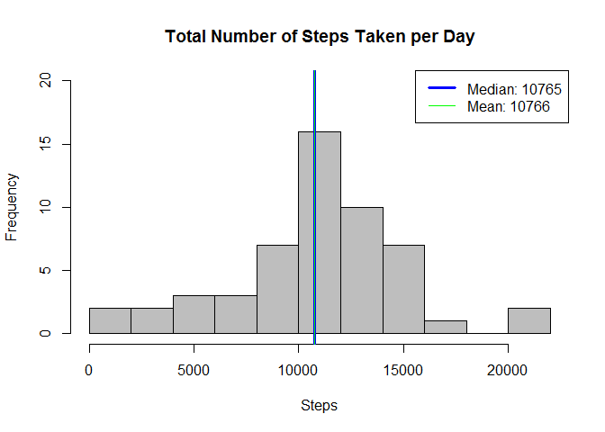
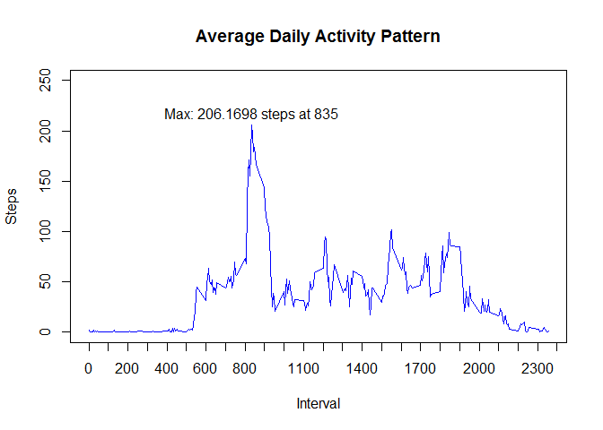
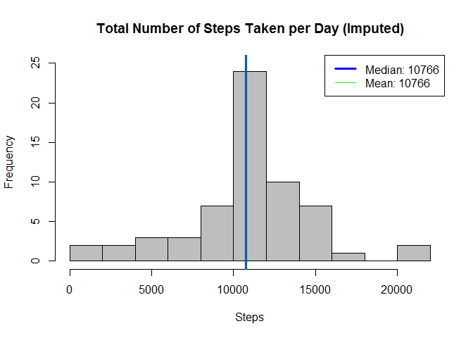
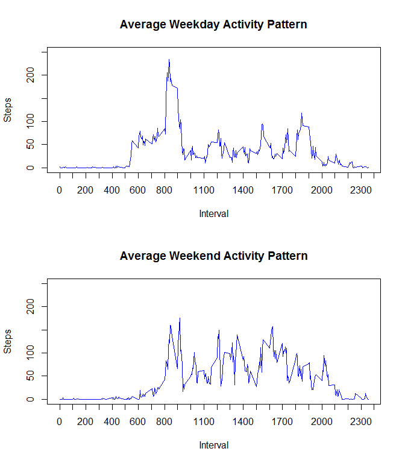

# Reproducible Research: Peer Assessment 1


## Loading and preprocessing the data


```r
# Code wrote using R 3.2.3, chron 2.3.47 and dplyr 0.4.3
library(chron)
library(dplyr)
```

```
## 
## Attaching package: 'dplyr'
```

```
## The following objects are masked from 'package:stats':
## 
##     filter, lag
```

```
## The following objects are masked from 'package:base':
## 
##     intersect, setdiff, setequal, union
```

```r
# Assume activity.zip is in the working directory
activity <- read.csv(unz('activity.zip','activity.csv'), 
                     stringsAsFactors = FALSE)

# Convert date to Date type
activity$date <- as.Date(activity$date, format = '%Y-%m-%d')
```


## What is mean total number of steps taken per day?


```r
# Group by date and calculate the sum for each day
sumDay <- group_by(activity, date) %>% summarize(steps = sum(steps))

# Calculate both median and mean ignorin NAs
mediand <- median(sumDay$steps, na.rm = TRUE)
meand <- mean(sumDay$steps, na.rm = TRUE)

# Plot a histogram of the total number of steps taken each day
hist(sumDay$steps, main = 'Total Number of Steps Taken per Day', breaks = 'fd', 
     xlab = 'Steps', ylim = c(0,20), col = 'grey')

# Add vertical lines for median and mean
abline(v = mediand, col = 'blue', lwd = 3)
abline(v = meand, col = 'green')

# Add a legend with values for median and mean
leg = c(paste('Median:', round(mediand,0)), paste('Mean:', round(meand,0)))
legend(legend = leg, x = 'topright', col = c('blue','green'), lwd = c(3,1))
```



See histogram legend for mean and median values.


## What is the average daily activity pattern?


```r
# Group by interval, calculate means ignoring NAs and capitalize variables
avgInterval <- group_by(activity, interval) %>% 
    summarize(steps = mean(steps, na.rm = TRUE )) %>%
    rename(Interval = interval, Steps = steps)

# Find the interval with the maximum number and create a label
max <- filter(avgInterval, Steps == max(avgInterval$Steps))
maxlabel = paste('Max:', round(max$Steps, 4),'steps at',max$Interval)

# Plot the time series
with(avgInterval, plot(Interval, Steps, main = 'Average Daily Activity Pattern', 
                       type = 'l', col = 'blue', 
                       xaxp = c(0,2400,24), ylim = c(0,250)))

# Add the maximum value to the plot
text(max$Interval, max$Steps + 10, labels = maxlabel)
```



The 5-minute interval with the maximum number of steps is 835 
with an average of 206.1698 steps.


## Imputing missing values


```r
# Calculate and report the total number of missing values in the dataset
missingIndex <- is.na(activity$steps) 
missing <- sum(missingIndex)
total <- nrow(activity)
message(missing," out of ", total," values are missing (NAs).")
```

```
## 2304 out of 17568 values are missing (NAs).
```

```r
# Make a copy of the original dataset
imputed <- activity

# Impute missing values with the interval mean
for(i in 1:total) {
    if(missingIndex[i])
        imputed[i,]$steps <- 
            avgInterval[avgInterval$Interval == imputed[i,]$interval,]$Steps
}

# Group by date and calculate the sum for each day
sumDayI <- group_by(imputed, date) %>% summarize(steps = sum(steps))

# Calculate both median and mean 
mediandI <- median(sumDayI$steps, na.rm = TRUE)
meandI <- mean(sumDayI$steps, na.rm = TRUE)

# Plot a histogram of the imputed total number of steps taken each day
hist(sumDayI$steps, main = 'Total Number of Steps Taken per Day (Imputed)', 
     breaks = 'fd', xlab = 'Steps', ylim = c(0,25), col = 'grey')

# Add vertical lines for median and mean
abline(v = mediandI, col = 'blue', lwd = 3)
abline(v = meandI, col = 'green')

# Add a legend with values for median and mean
legI = c(paste('Median:', round(mediandI,0)), paste('Mean:', round(meandI,0)))
legend(legend = legI, x = 'topright', col = c('blue','green'), lwd = c(3,1))
```



Both imputed mediand and mean steps per day are very similar to the original values,
suggesting that imputing missing values with the interval mean has little impact on
both summary statistics.


## Are there differences in activity patterns between weekdays and weekends?


```r
# Create a new factor variable in the dataset: "weekday" and "weekend" 
activity$daytype <- factor(is.weekend(activity$date), 
                           labels = c('weekday','weekend'))

# Group by interval and daytype, calculate means ignoring NAs and capitalize variables
avgIntervalW <- group_by(activity, interval, daytype) %>% 
    summarize(steps = mean(steps, na.rm = TRUE )) %>%
    rename(Interval = interval, Steps = steps)

# Set up the panels
par(mfrow = c(2,1))

# Plot weekdays
with(avgIntervalW[avgIntervalW$daytype == 'weekday',], 
     plot(Interval, Steps, main = 'Average Weekday Activity Pattern', 
                       type = 'l', col = 'blue', 
                       xaxp = c(0,2400,24), ylim = c(0,250)))

# Plot weekends
with(avgIntervalW[avgIntervalW$daytype == 'weekend',], 
     plot(Interval, Steps, main = 'Average Weekend Activity Pattern', 
          type = 'l', col = 'blue', 
          xaxp = c(0,2400,24), ylim = c(0,250)))
```



The plots suggest that there's more activity in the early morning during weekdays
but that there's more activity during the day on weekends.
